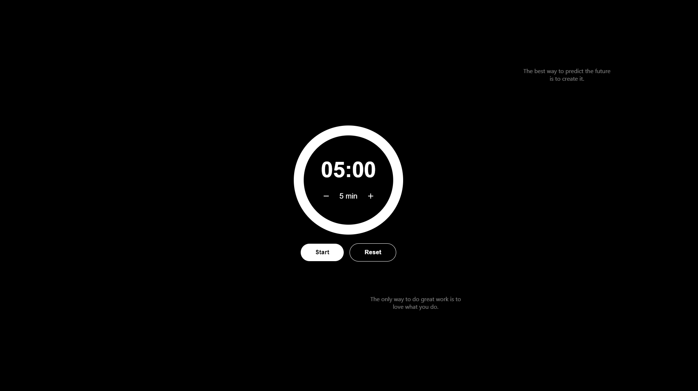

# Custom Timer Web Application

## Preview



## Overview

This project is a custom timer web application that combines functionality with motivational quotes. It features a sleek, minimalist design with a dark theme, providing users with a focused and inspiring environment for time management.

## Features

- **Interactive Timer**: A visually appealing timer with start, pause, and reset functionality.
- **Dynamic Quotes**: Floating motivational quotes that change periodically, providing inspiration while you work.
- **Responsive Design**: Fully responsive layout that works well on both desktop and mobile devices.

## Technology Stack

- **Frontend**:
  - React.js: For building the user interface
  - CSS: For styling and animations
  - JavaScript: For interactive functionality
- **Backend**:
  - ASP.NET Core: For serving the quotes API
  - C#: Backend logic and API endpoints
- **Deployment**:
  - Docker: For containerizing the application

## How to Run

You can easily run through Docker on your computer.

### Docker

Prerequisites:

- Docker installed on your machine
- Docker Compose installed on your machine

1. Clone the repository

```bash
git clone https://github.com/eliashovdenes/React-Timer-Website
cd <project-directory>
```

2. Build and start the containers

```bash
docker-compose up --build
```

This will:

- Build both frontend and backend images
- Start the containers
- Set up the network between them

To stop the containers:

```bash
docker-compose down
```

After successful startup:

- Frontend will be available at http://localhost
- Backend API will be available at http://localhost:5000

---

Troubleshooting

- If you get a permission error for port 80, try running the command with sudo (Linux/Mac) or as administrator (Windows)
- If the ports are already in use, ensure no other applications are running on ports 80 and 5000
- To check if containers are running: docker ps
- To check container logs: docker-compose logs <service_name> (where service_name is 'frontend' or 'backend')
